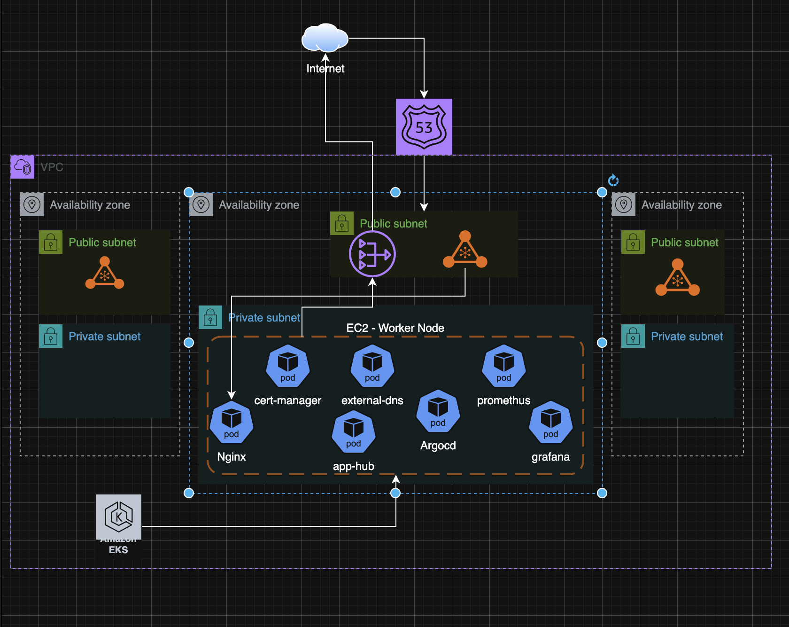

# EKS Kubernetes Lab

## Overview

Production-grade EKS cluster deployed with Terraform, featuring automated TLS, DNS management, GitOps with ArgoCD, monitoring with Prometheus/Grafana, and CI/CD with GitHub Actions.

## Tools Used

- **Terraform** — Infrastructure as Code (EKS, VPC, IAM)
- **Helm** — K8s package manager
- **NGINX Ingress Controller** — Ingress/traffic management
- **Let's Encrypt** — Certificate authority
- **cert-manager** — Automates TLS certificate provisioning
- **external-dns** — Syncs ingress hosts with Route 53 DNS
- **ArgoCD** — GitOps continuous deployment
- **Prometheus** — Cluster metrics collection
- **Grafana** — Metrics visualisation and dashboards
- **GitHub Actions** — CI/CD pipeline
- **Checkov** — Terraform and Kubernetes security scanning
- **Grype** — Vulnerability scanning
- **pre-commit** — Git hooks for code quality

## Architecture



## Infrastructure

| Component | Details |
|-----------|---------|
| Cluster | EKS v1.31 |
| Region | eu-west-2 |
| VPC | 10.0.0.0/16 (3 AZs) |
| Worker Nodes | Managed node group (t3a.large / t3.large) |
| IRSA | cert-manager + external-dns |
| State | S3 backend |
| CI/CD | GitHub Actions (OIDC auth) |
| Monitoring | Prometheus + Grafana |

## Deployed Apps

- **ArgoCD** — `argocd.eiddev.xyz`
- **app-hub** — `app-hub.eiddev.xyz`
- **Grafana** — `grafana.eiddev.xyz`

## Usage

```bash
make init
make apply
make deploy
```

## Makefile Commands

| Command | Description |
|---------|-------------|
| `make init` | Terraform init |
| `make plan` | Terraform plan |
| `make apply` | Terraform apply |
| `make destroy` | Terraform destroy |
| `make lint` | Terraform fmt + validate |
| `make sec` | Checkov + Grype scans |
| `make kubeconfig` | Update local kubeconfig |
| `make deploy` | Apply issuer + ArgoCD app |
| `make cleanup` | Run cleanup script |

## CI/CD Pipeline

GitHub Actions pipeline triggers on:
- **Pull requests** → lint, security scan, terraform plan
- **Push to main** → lint, security scan, terraform plan + apply

Authentication via OIDC — no static credentials.

## Security

- Pre-commit hooks (YAML validation, Terraform fmt, Checkov)
- Checkov scanning (Terraform + Kubernetes)
- Grype vulnerability scanning
- Hardened Kubernetes deployments (security context, resource limits, health probes, NetworkPolicy)

## Cleanup

```bash
make cleanup
```
