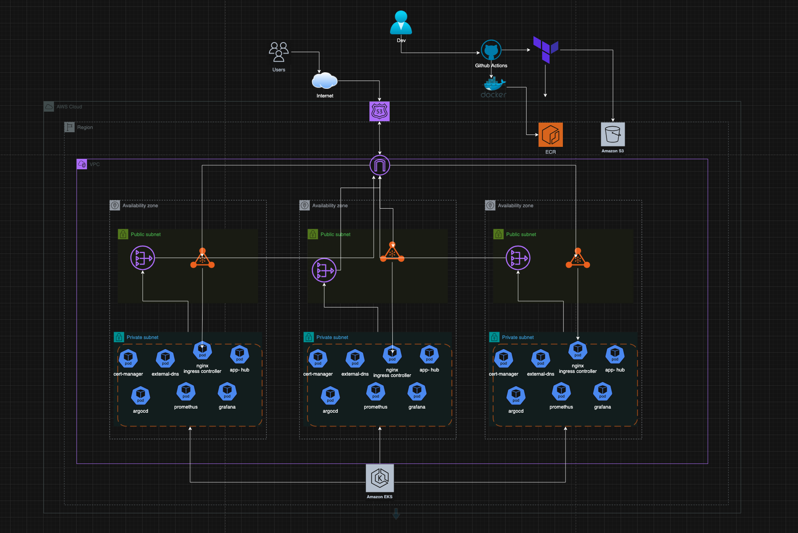
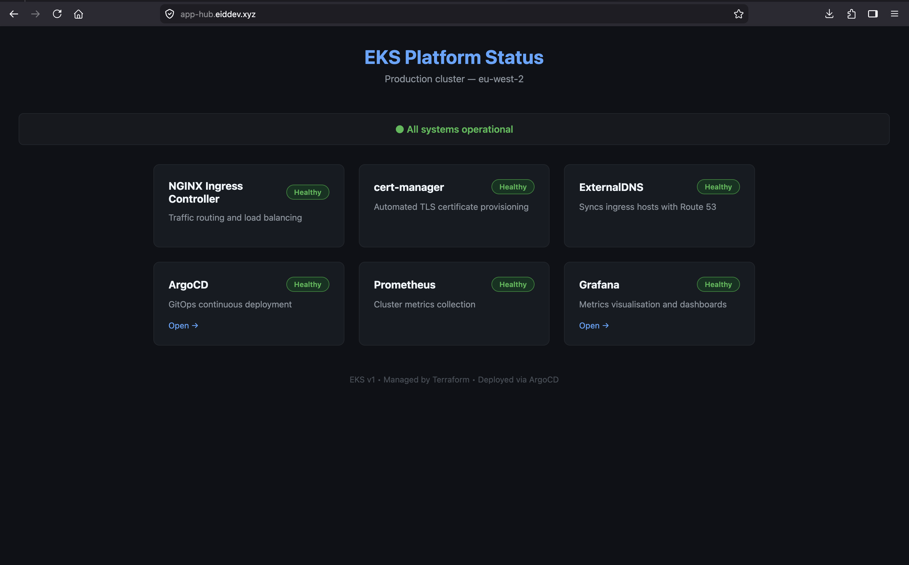
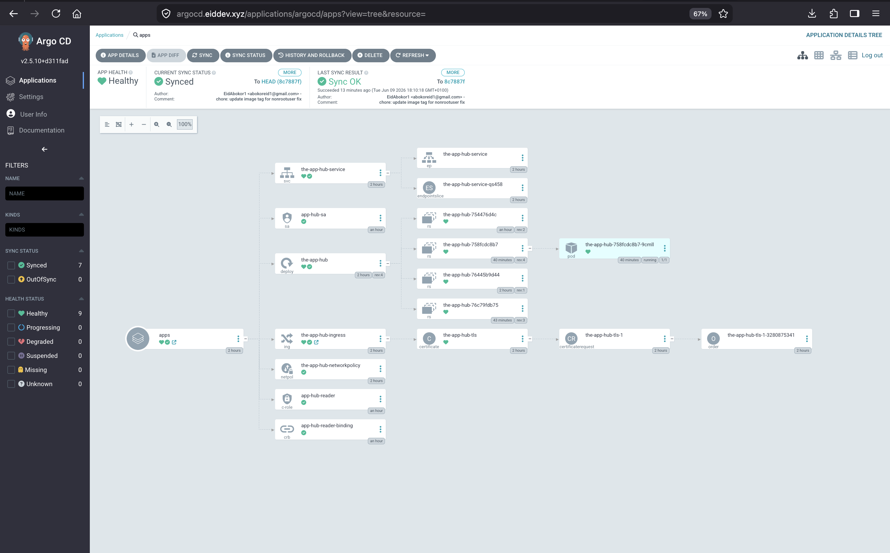
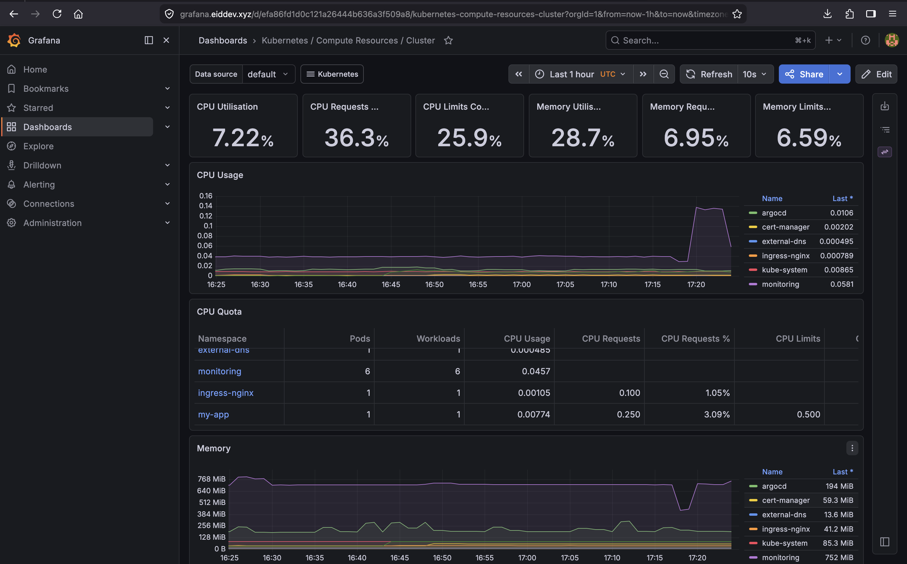
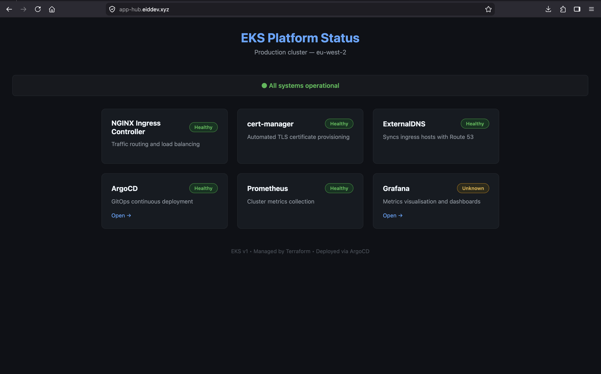

# EKS Status Hub

## Overview

Production-grade EKS cluster deployed with Terraform, featuring an EKS Status Hub app to track the health of Kubernetes components, automated TLS, DNS management, GitOps with ArgoCD, monitoring with Prometheus/Grafana, and CI/CD with GitHub Actions.

## Tools Used

- **Terraform** — Infrastructure as Code (EKS, VPC, IAM)
- **Helm** — K8s package manager
- **NGINX Ingress Controller** — Ingress/traffic management
- **Let's Encrypt** — Certificate authority
- **cert-manager** — Automates TLS certificate provisioning
- **external-dns** — Syncs ingress hosts with Route 53 DNS
- **ArgoCD** — GitOps continuous deployment
- **Prometheus** — Cluster metrics collection
- **Grafana** — Metrics visualisation and dashboards
- **GitHub Actions** — CI/CD pipeline
- **Amazon ECR** — Container image registry
- **Python/Flask** — EKS Status Hub app (tracks live status of K8s components)
- **Gunicorn** — Production WSGI server
- **Checkov** — Terraform and Kubernetes security scanning
- **Grype** — Vulnerability scanning
- **pre-commit** — Git hooks for code quality

## EKS Status Hub App

A Python/Flask platform status page that tracks the live health of Kubernetes components by calling the Kubernetes API from inside the cluster.

- Queries the K8s API for each component's deployment status
- Displays `Healthy` (green), `Degraded` (red), or `Unknown` (yellow) per component
- RBAC-scoped service account — only has `get` and `list` permissions on deployments
- Served by Gunicorn behind NGINX Ingress with TLS
- `/health` endpoint for Kubernetes liveness and readiness probes
- HPA configured to scale between 1-3 replicas based on CPU utilisation

## Architecture



## Infrastructure

| Component | Details |
|-----------|---------|
| Cluster | EKS v1.31 |
| Region | eu-west-2 |
| VPC | 10.0.0.0/16 (3 AZs) |
| Worker Nodes | Managed node group (t3a.large / t3.large) |
| IRSA | cert-manager + external-dns |
| State | S3 backend |
| CI/CD | GitHub Actions (OIDC auth) |
| Container Registry | Amazon ECR |
| Monitoring | Prometheus + Grafana |
| Autoscaling | HPA (min 1, max 3 replicas) |

## Deployed Apps

- **ArgoCD** — `argocd.eiddev.xyz`
- **eks-status-hub** — `app-hub.eiddev.xyz`
- **Grafana** — `grafana.eiddev.xyz`

### EKS Status Hub


### ArgoCD


### Grafana


### EKS Status Hub — Degraded State


## Usage

```bash
make init
make apply
make deploy
```

## Makefile Commands

| Command | Description |
|---------|-------------|
| `make init` | Terraform init |
| `make plan` | Terraform plan |
| `make apply` | Terraform apply |
| `make destroy` | Terraform destroy |
| `make lint` | Terraform fmt + validate |
| `make sec` | Checkov + Grype scans |
| `make kubeconfig` | Update local kubeconfig |
| `make deploy` | Apply issuer + ArgoCD app |
| `make cleanup` | Run cleanup script |

## CI/CD Pipelines

Two separate pipelines:

**Infra Pipeline (`ci.yml`)** — triggers on changes to `terraform/`
- Pull requests → lint, security scan, terraform plan
- Push to main → plan job first, then apply job (requires plan to pass)

**Docker Pipeline (`docker.yml`)** — triggers on changes to `app/`
- Grype vulnerability scan
- Docker image build
- Push to Amazon ECR tagged with Git commit SHA
- Automatically updates image tag in `apps/app-hub.yml` and commits back to repo
- ArgoCD detects the change and deploys the new image automatically

Authentication via OIDC — no static credentials stored anywhere.

## Security

- Pre-commit hooks (YAML validation, Terraform fmt, Checkov)
- Checkov scanning (Terraform + Kubernetes)
- Grype vulnerability scanning on both Terraform and Docker image
- Hardened Kubernetes deployments (security context, resource limits, health probes, NetworkPolicy)
- Non-root container user (UID 10000)
- Immutable ECR image tags
- ECR images encrypted at rest with KMS

## What I Learnt

**IRSA (IAM Roles for Service Accounts)**
How to link Kubernetes service accounts to AWS IAM roles via OIDC so pods get scoped permissions without static credentials.

**Helm Dependency Ordering**
cert-manager CRDs must be installed before applying a ClusterIssuer, and external-dns needs its IRSA role ready before deployment. Order matters.

**End-to-End TLS Flow**
Ingress annotation triggers cert-manager, which creates a Certificate resource, runs a DNS-01 challenge via Route 53, and stores the resulting cert as a Kubernetes Secret. NGINX then serves it automatically.

**GitOps with ArgoCD**
ArgoCD reconciles cluster state with the Git repo continuously. The repo is the single source of truth — any manual change to the cluster gets reverted.

**NetworkPolicies**
How to enforce pod-level traffic control, restricting ingress to only the nginx-ingress namespace so no other pod can reach the app directly.

**OIDC Federation for CI/CD**
GitHub Actions assumes an AWS IAM role using short-lived tokens via OIDC. No static credentials stored anywhere.

**Kubernetes as a REST API**
Making HTTP GET requests from inside a pod using a mounted service account token to query deployment health and display it in a Flask app.

**RBAC in Practice**
Scoping a service account to only `get` and `list` on deployments rather than giving it broad cluster access.

**GitOps Image Tag Automation**
The CI pipeline commits the new image SHA back to the repo after every build so ArgoCD deploys the latest version without any manual steps.

## Challenges Solved

**Helm Chart Version Conflicts**
Some chart versions had breaking changes or deprecated values. Had to pin versions (e.g. ArgoCD `5.19.15`, kube-prometheus-stack `84.3.0`) and cross-reference changelogs to get compatible configurations.

**cert-manager DNS-01 Validation Failing**
The IRSA role wasn't being assumed correctly because the service account annotation wasn't matching. Fixed by ensuring the namespace/service account pair in the IRSA module matched exactly what cert-manager deployed.

**ExternalDNS Not Updating Route 53**
Permissions were correct but the hosted zone filter wasn't set, so external-dns was trying to manage zones it shouldn't. Adding the domain filter in the Helm values resolved it.

**Terraform Dependency Ordering**
Helm releases were attempting to deploy before the EKS cluster was fully ready. Solved by relying on implicit dependencies through the provider configuration and module outputs.

**GitHub Actions OIDC Trust Policy**
The IAM role's trust policy needed the exact GitHub repo and branch conditions. Debugging required checking CloudTrail for `AssumeRoleWithWebIdentity` failures.

**Ingress Not Getting an External IP**
The NGINX ingress controller needed the AWS load balancer to provision in public subnets. Required correct subnet tagging (`kubernetes.io/role/elb = 1`) in the VPC Terraform config.

**EKS Access Entry Conflicts**
The EKS Terraform module automatically creates a `cluster_creator` access entry which conflicted with manually defined entries, causing repeated pipeline failures. Fixed by setting `enable_cluster_creator_admin_permissions = false` and managing access entries explicitly.

**Terraform Apply Locking Out Cluster Access**
Destroying the Admin access entry mid-apply caused kubectl to lose access. Recovered by manually recreating the access entry via AWS CLI and reimporting into Terraform state.

## Cleanup

```bash
make cleanup
```
